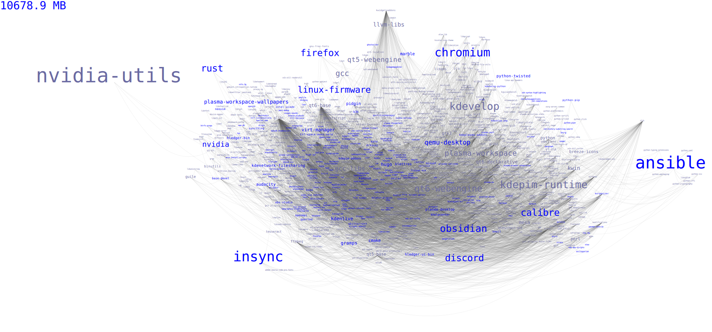

+++
title = 'Identifying unused dependencies with pacgraph'
date = 2024-04-24T06:35:38-04:00
cover = 'pacgraph.svg'
coverCaption = "My system's dependencies at the time of writing this"
draft = false
+++

Pacgraph provides a graph of your Arch Linux system's package dependencies. You can install it from the AUR:

paru -S pacgraph


It's helped identify packages that I had no idea were installed. After identifying the ones you don't need, you can remove them:


sudo pacman -R packages_to_remove


After you've removed a few packages, you can run use this one-liner to remove any orphaned packages. An orphan is a package that was installed as a dependency of something that you already removed.


sudo pacman -Rns $(pacman -Qtdq)


Or my script remove_orphans.sh which includes a bit of error handling:


#!/bin/bash
orphans=$(pacman -Qtdq)
if [ -z "$orphans" ]
then
    echo "No orphans to remove"
else
    sudo pacman -Rns $orphans
fi


And then you can run pacgraph a second time after removing some packages, it will show other packages that it didn't previously have room for.

I use this bash alias to quickly run it:

alias pg='pacgraph -f /tmp/pacgraph && feh /tmp/pacgraph.svg'


That can go in your ~/.bashrc or wherever else your aliases are stored. Mine looks like this:

I made the mistake of installing kde-applications when switching to Plasma 6, so now I have a lot of packages to remove.
